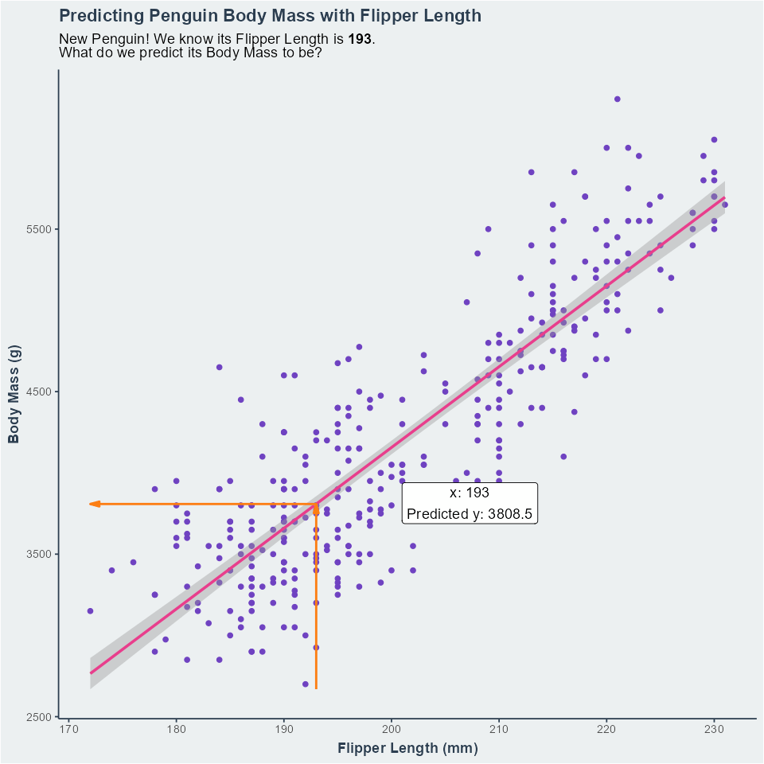

## Visualising Linear Regression

When we want to understand the relationship between two numerical variables,
we usually want to visualise them with a scatter plot. 

Let's do that with some penguin biometric data to start understanding how
linear regression works.

```{r environment-setup, echo=TRUE, eval=TRUE, message=FALSE}
# Load packages
library(tidyverse)
library(palmerpenguins)
```

```{r environment-setup-source, echo=FALSE, eval=TRUE, message=FALSE}
# General
walk(
  .x = list.files(path = here::here("R"), pattern = "^src_", full.names = TRUE),
  .f = source, 
  .GlobalEnv
)

# Additional
source(here::here("R", "pearson-r-image-src.R"), .GlobalEnv)
```

```{r environment-setup-ggplot, echo=FALSE, eval=TRUE, message=FALSE}
# Set ggplot theme
theme_set(ggtheme())
```

```{r penguin-setup, eval=TRUE, echo=TRUE}
# Setup penguin data, with short column names for ease
penguin <- penguins %>% 
  rename_with(str_remove_all, pattern = "_mm$|_g$") %>% 
  rename_with(str_remove_all, pattern = "(?<=len)gth$") %>% 
  as_tibble() %>% 
  drop_na()

# Print head, to preview
print(head(penguin))
```

```{r plt-penguin-scatter-fl-mass, warning=FALSE, echo=TRUE, eval=TRUE}
plt_penguin_scatter_fl_mass <- ggplot(penguin, aes(x=flipper_len, y=body_mass)) +
  geom_point(size = 2) +
  labs(x = "Flipper Length (mm)", y = "Body Mass (g)")

plt_penguin_scatter_fl_mass
```


```{r quiz-plt-penguin-scatter-fl-mass-interpret}
quiz(
  question(
    "Which of these are TRUE?",
    answer("Flipper Length is negatively correlated with Body Mass"),
    answer("Body Mass increases with Flipper Length", correct = TRUE),
    answer("High Flipper Length causes high Body Mass"),
    answer("Flipper Length and Body Mass are strongly correlated", correct = T),
    type = "multiple",
    message = paste(
      "We have a strong positive correlation between Flipper Length",
      "and Body Mass. This means that Body Mass **increases** with Flipper",
      "Length. We **cannot** infer that change in Flipper Length **causes**",
      "change in Body Mass, however."
    )
  )
)
```

### Understanding our data

We have a clear **linear** relationship between penguins' flipper length and 
their body mass. Our data points are arranged in a 'cloud' that follows a
straight line. 

This tells us that Linear Regression is a sensible method for building a model
to predict Body Mass.

Body Mass increases with Flipper Length, so this is a positive
correlation. Calculating Pearson's correlation coefficient tells us that 
this is strong:

```{r pearson-penguin-fl-mass, echo=TRUE, eval=TRUE}
pearson_penguin_fl_mass <- cor(
  x = penguin$flipper_len, 
  y =penguin$body_mass, 
  use = "complete", 
  method = "pearson"
)

round(pearson_penguin_fl_mass, digits=3)
```

```{r pearson-demo, echo=FALSE, eval=TRUE}
#| fig.cap = "**Pearson's Correlation Coefficient** (*r*d): Minimum and maximum 
#| values are -1 and 1. Values far from 0 indicate strong correlations, 0
#|  indicates no correlation. Positive values are positive correlations, negative
#|  numbers are negative correlations."
glue_str <- "r = {round(pearson, digits = 1)}"
plot <- ggplot(gen_pearson_demo(), aes(x, y, col = pearson)) +
  geom_point(size = 2) +
  geom_smooth(se = F, method = "lm", formula = y ~ x) +
  geom_text(
    mapping = aes(x = 15, y = 40, label = glue::glue(glue_str)), 
    col = get_pal("primary")
  ) +
  scale_color_distiller(type = "div", guide = "none") +
  coord_equal() +
  facet_wrap(~type, nrow = 1) +
  theme(
    axis.line = element_blank(),
    axis.text = element_blank(),
    axis.ticks = element_blank(),
    strip.background = element_blank(),
    panel.border = element_rect(
      color = get_pal("primary"), 
      fill = "transparent",
      size = .05,
    ),
    strip.text = element_text(
      face = "bold", 
      size = 12, 
      color = get_pal("secondary")
    )
  )
plot
```


### Plotting a linear regression

When our data our linearly correlated, we can draw a line through the data to
predict our 'y' variable from our 'x' variable. In this case, we'll be using
Flipper Length to predict Body Mass. This line is a linear regression.

```{r plt-penguin-lreg-fl-mass, echo=TRUE, eval=TRUE, warning=FALSE, message=FALSE}
plt_penguin_scatter_fl_mass +
  geom_smooth(method = "lm")
```

Having drawn our regression line, we can now use it to predict the body mass of
a penguin with any flipper length between ~170mm and ~230mm (the range of our
data). In general terms, this is like drawing a line up from the x-axis to our
regression line, and finding the value of the y-axis at that point.

```{r anim-lr-001, fig.cap="Making predictions with linear regression. Imagine we add a new penguin to our dataset, and we don't know its body mass. Our linear model could predict it for us using the penguin's flipper length.", eval=TRUE, out.width='80%'}

```

```{r lm-penguin-fl-bm, echo=FALSE, eval=TRUE}
# Setup linear model for illustrative plots
lm_penguin_fl_bm <- lm(body_mass ~ flipper_len, data = penguin)

# Setup predictor partial for plotting ease
predict_lm_penguin_fl_bm <- partial(predict, object = lm_penguin_fl_bm)
```

```{r lm-penguin-fl-bm-test, echo=FALSE, eval=FALSE}
# Testing chunk for `predic_lm_penguin_flm_bm`
predict_lm_penguin_fl_bm(newdata = tibble(flipper_len = c(180)))
```